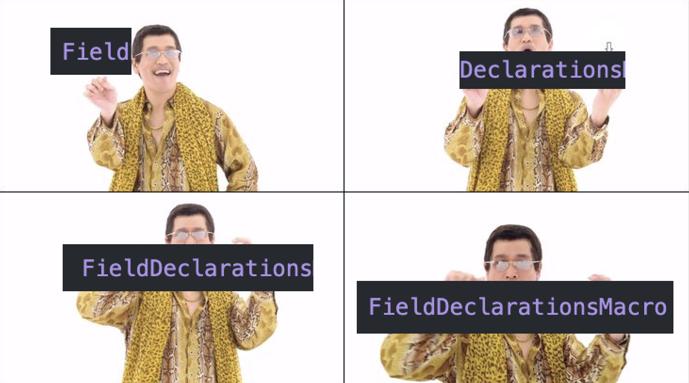
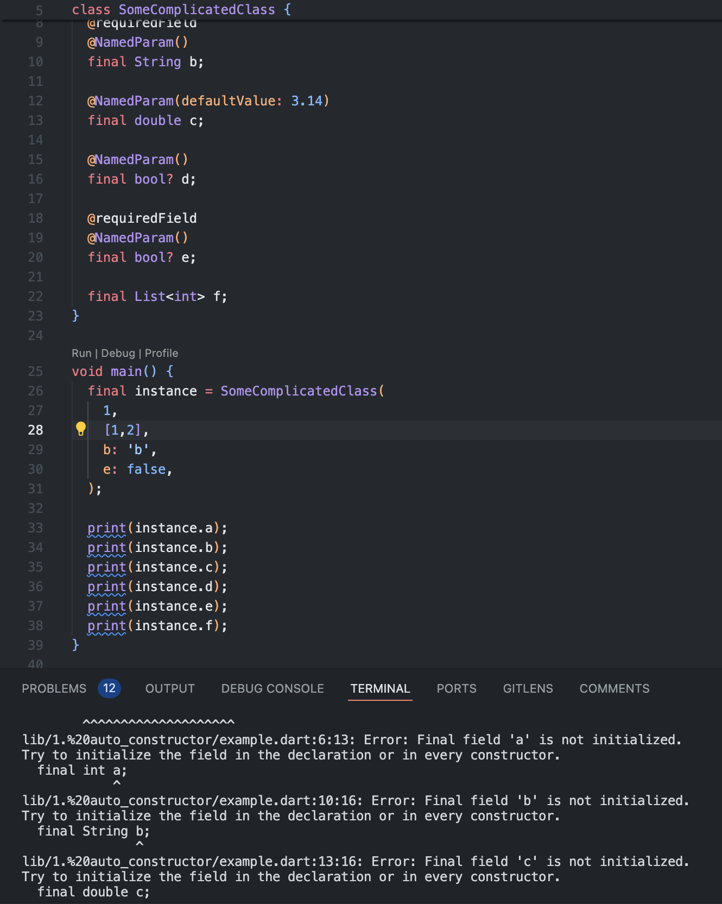

# Ещё одна статья про макросы

Про макросы в Dart написано уже немало статей, но в этой статье будет минимум теории и максимум практики и рассуждений. Мы вместе пройдём путём разработчика, который только начал изучать макросы и будем:
- придумывать разные способы упростить себе жизнь с помощью макросов;
- формировать гипотезы (описывать то, что хотим получить);
- писать код и проверять гипотезы;
- радоваться результатам или разбираться, что пошло не так.

## Знакомство с макросами

Макросы - это проявление метапрограммирования в языке Dart. Подробнее о них можно прочитать в одной из статей:
- [Макросы на Dart: первые ощущения от использования и лайфхаки на будущее](https://habr.com/ru/articles/829560/);
- [Пишем собственный макрос на Dart 3.5 вместо старого генератора кода](https://habr.com/ru/articles/821911/).

Здесь же мы слегка "пробежимся" по основным моментам, которые нам понадобятся в дальнейшем.

### Действующие лица

#### Макрос

- Непосредственно то, что пишет разработчик;
- С точки зрения Dart является классом;
- Должен иметь константный конструктор (как и любой класс, который может быть использован в качестве аннотации);
- Имеет доступ к информации о цели;
- Генерирует код на основании этой информации.

#### Цель

- То, к чему применяется макрос;
- Может быть классом, методом, полем, top-level переменной, top-level функцией, библиотекой, конструктором, миксином,  расширением, перечислением, полем перечисления, type alias'ом;
- Может быть целью нескольких макросов сразу.

#### Сгенерированный код

- Появляется в режиме редактирования кода по мере изменения кода макроса/цели;
- readonly;
- форматирование кода - прерогатива разработчика, поэтому обычно на него без слёз не взглянешь.

### Устройство макроса

Как уже было сказано, макрос это класс. Помимо этого:
- этот класс должен иметь ключевое слово `macro` в объявлении;
- реализовывать один из интерфейсов макросов. Каждый из интерфейсов определяет, к какой цели и в какой фазе макрос будет применён.

### Фазы макросов

#### Фаза определения типов

- Выполняется первой;
- Только в этой фазе доступно объявление новых типов (классов, typedef, перечислений и т.д.);
- Практически не имеет доступа к уже имеющимся типам;
- По сути, на этом её полномочия всё.

#### Фаза объявления

- Выполняется после фазы типов;
- В этой фазе можно объявлять новые поля, методы (но не классы и прочие типы);
- Имеет доступ к уже объявленным типам - но только если они указаны явно;
- Самая, на мой взгляд, полезная и свободная фаза - можно писать практически любой код - как в класс, так и в файл.

#### Фаза определения

- Выполняется последней;
- В этой фазе можно дополнять (`augment`) уже объявленные поля, методы, конструкторы;
- Можно узнать типы полей, методов и т.д., даже если они не указаны явно.

### Как выбрать интерфейс макроса?

- Выбираем цель;
- Определяем, что мы хотим сделать с этой целью (то есть, выбираем фазу);
- Путём несложной комбинации получаем название интерфейса (за исключением части `Macro` в конце);
- .


## Рубрика "Эксперименты"

Да начнётся практика! Но сперва определим то, как она будет проходить.

Каждый пункт этого раздела будет основываться на ответах на следующие вопросы:
- Зачем? (обоснование полезности);
- Как это должно выглядеть? (ожидаемый результат в виде кода);
- Как это реализовать? (реализация);
- Работает ли это? Если нет, то почему? (разбор особенностей/ограничений).

### Авто-конструктор

#### Зачем?

Будем честны - даже с помощью IDE создание конструктора класса с большим количеством полей - это не самый лучший способ тратить время. Да и довольно утомительно бывает дополнять уже существующий конструктор новыми полями. Кроме того, конструктор для класса с большим количеством полей может занимать много строк кода, что не всегда положительно сказывается на читаемости.

#### Как это должно выглядеть?

> [!NOTE]
> Для простоты предлагаю опустить кейсы с `super`-конструкторами и с приватными именованными полями - нам и так будет, чем заняться.

Поля класса могут инициализироваться:
- позиционными параметрами конструктора;
- именованными параметрами конструктора;
- константными значениями по умолчанию;
- как обязательные;
- как необязательные;
- не в конструкторе вовсе.

Надо предусмотреть все эти случаи. Для этого мы можем использовать аннотирование полей класса:

```dart
@AutoConstructor()
class SomeComplicatedClass {
  final int a;

  @NamedParam()
  final String b;

  @NamedParam(defaultValue: 3.14)
  final double c;

  @NamedParam(isRequired: false)
  final bool? d;

  @NamedParam(isRequired: true)
  final bool? e;

  final List<int> f;
}
```

```dart
augment class SomeComplicatedClass {
  SomeComplicatedClass(this.a, this.f, {required this.b, this.c = 3.14, this.d, required this.e});
}
```

#### Как это реализовать?

Начнём с самого простого - в отдельном файле создадим класс `NamedParam` для аннотирования полей класса:

```dart
class NamedParam {
  final bool isRequired;
  final Object? defaultValue;
  const NamedParam({this.defaultValue, this.isRequired = true});
}
```

Теперь создадим макрос, который будет делать всю работу за нас. Заодно порассуждаем, какая фаза макроса нам подходит:
- Мы не собираемся определять новые типы, поэтому фаза типов нам точно не подходит;
- Фаза объявления позволяет нам писать код внутри класса, а также оперировать полями класса, что нам и нужно;
- Фаза определения позволяет дополнять конструктор класса, но не даёт возможность писать конструктор с нуля (то есть, конструктор уже должен присутсвовать в классе) - не наш вариант.

Таким образом, мы выбираем фазу объявления. Создадим макрос `AutoConstructor`, получим список полей и начнём складывать код конструктора и параметры:

```dart
import 'dart:async';

import 'package:macros/macros.dart';

macro class AutoConstructor implements ClassDeclarationsMacro {
  @override
  FutureOr<void> buildDeclarationsForClass(ClassDeclaration clazz, MemberDeclarationBuilder builder) async {
    final fields = await builder.fieldsOf(clazz);

    /// Сюда мы будем собирать код.
    /// Начнём с объявления конструктора.
    /// Например:
    /// ClassName(
    ///
    final code = <Object>[
      '\t${clazz.identifier.name}(\n',
    ];

    /// Список всех позиционных параметров.
    final positionalParams = <Object>[];

    /// Список всех именнованных параметров.
    final namedParams = <Object>[];
  }
}
```

Следующая задача, которую нам нужно решить - это научиться определять, есть ли у поля аннотация `NamedParam` и если есть - какие у неё параметры. Для этого мы просто пройдёмся по всем аннотациям поля и найдём нужную нам:

```dart
    for (final field in fields) {
      /// Список всех аннотаций поля.
      final annotationsOfField = field.metadata;
      /// Достаём аннотацию NamedParam (если она есть).
      final namedParam = annotationsOfField.firstWhereOrNull(
        (element) => element is ConstructorMetadataAnnotation && element.type.identifier.name == 'NamedParam',
      ) as ConstructorMetadataAnnotation?;
    }
```

> [!INFO]
> Небольшое пояснение к коду выше - аннотации в Dart могут быть двух типов:
> - константное значение (например, `@immutable` или `@override`);
> - вызов конструктора (например, `@Deprecated('Use another method')`).
> 
> Так как `NamedParam` относится ко второму типу, мы ищем аннотацию, которая является вызовом конструктора и имеет имя `NamedParam`. Иначе нам бы потребовался не `ConstructorMetadataAnnotation`, а `IdentifierMetadataAnnotation`.

У аннотации есть два именованных параметра - `defaultValue` и `isRequired`. Давайте их достанем:

```dart
      if (namedParam != null) {
        final defaultValue = namedParam.namedArguments['defaultValue'];
        
        final isRequired = namedParam.namedArguments['isRequired'];
      ...
      }
```
И вот тут начинаются проблемы - мы не можем узнать значение `isRequired`, так как API макросов не даёт прямой доступ к значению поля, а предоставляет только объект типа `ExpressionCode`, который представляет собой код выражения. 

Но мы не сдадимся так просто - давайте создадим отдельную аннотацию для обязательных полей - `requiredField`. Эта аннотация может быть не классом, а констатным значением:

```dart
  const requiredField = Required();

  class Required {
    const Required();
  }
```

Отредактируем наш исходный класс:

```dart
@AutoConstructor()
class SomeComplicatedClass {
  final int a;

  @requiredField
  @NamedParam()
  final String b;

  @NamedParam(defaultValue: 3.14)
  final double c;

  @NamedParam()
  final bool? d;

  @requiredField
  @NamedParam()
  final bool? e;

  final List<int> f;
}
```


Теперь найдём эту аннотацию у поля:

```dart
      if (namedParam != null) {
        final defaultValue = namedParam.namedArguments['defaultValue'];
        
        final isRequired = annotationsOfField.any(
          (element) => element is IdentifierMetadataAnnotation && element.identifier.name == 'requiredField',
        );
      ...
      }
```

Теперь сформируем код с инициализацией именованных параметров.

Что должно получиться:
```dart
    required this.b,
    this.c = 3.14,
    this.d,
    this.e,
```

Как мы это сделаем:
```dart
        namedParams.addAll(
          
          [
            '\t\t',
            if (isRequired && defaultValue == null) ...[
              'required ',
            ],
            'this.${field.identifier.name}',
            if (defaultValue != null) ...[
              ' = ',
              defaultValue,
            ],
            ',\n',
          ],
        );
```

Теперь займёмся позиционными параметрами - тут всё проще, нам нужно просто добавить их в список:

```dart
       if (namedParam != null) {
        ...
      } else {
        positionalParams.add('\t\tthis.${field.identifier.name},\n');
      }
```

Соберём все воедино и добавим код в класс:

```dart
  {
    ...
    code.addAll([
      ...positionalParams,
      '\t\t{\n',
      ...namedParams,
      '\t\t}',
      '\n\t);',
    ]);

    builder.declareInType(DeclarationCode.fromParts(code));
  }
```

#### Результат

Применим макрос к классу `SomeComplicatedClass`:

```dart
@AutoConstructor()
class SomeComplicatedClass {
  final int a;

  @requiredField
  @NamedParam()
  final String b;

  @NamedParam(defaultValue: 3.14)
  final double c;

  @NamedParam()
  final bool? d;

  @requiredField
  @NamedParam()
  final bool? e;

  final List<int> f;
}
```

И получим следующий результат:

```dart
augment library 'package:test_macros/1.%20auto_constructor/example.dart';

augment class SomeComplicatedClass {
	SomeComplicatedClass(
		this.a,
		this.f,
		{
		required this.b,
		this.c = 3.14,
		this.d,
		this.e,
		}
	);
}
```

Приведу полный код макроса:

```dart

macro class AutoConstructor implements ClassDeclarationsMacro {
  const AutoConstructor();

  @override
  FutureOr<void> buildDeclarationsForClass(ClassDeclaration clazz, MemberDeclarationBuilder builder) async {
    final fields = await builder.fieldsOf(clazz);

    /// Сюда мы будем собирать код.
    final code = <Object>[
      '\t${clazz.identifier.name}(\n',
    ];

    /// Список всех позиционных параметров.
    final positionalParams = <Object>[];

    /// Список всех именнованных параметров.
    final namedParams = <Object>[];

    for (final field in fields) {
      /// Список всех аннотаций поля.
      final annotationsOfField = field.metadata;

      /// Достаём аннотацию NamedParam (если она есть).
      final namedParam = annotationsOfField.firstWhereOrNull(
        (element) => element is ConstructorMetadataAnnotation && element.type.identifier.name == 'NamedParam',
      ) as ConstructorMetadataAnnotation?;

      if (namedParam != null) {
        final defaultValue = namedParam.namedArguments['defaultValue'];

        final isRequired = annotationsOfField.any(
          (element) => element is IdentifierMetadataAnnotation && element.identifier.name == 'requiredField',
        );

        namedParams.addAll(
          [
            '\t\t',
            if (isRequired && defaultValue == null) ...[
              'required ',
            ],
            'this.${field.identifier.name}',
            if (defaultValue != null) ...[
              ' = ',
              defaultValue,
            ],
            ',\n',
          ],
        );
      } else {
        positionalParams.add('\t\tthis.${field.identifier.name},\n');
      }
    }

    code.addAll([
      ...positionalParams,
      '\t\t{\n',
      ...namedParams,
      '\t\t}',
      '\n\t);',
    ]);

    builder.declareInType(DeclarationCode.fromParts(code));
  }
}
```

Мы почти достигли результата, которого хотели, но при этом столкнулись с ограничением API макросов - мы не можем оперировать значениями `ExpressionCode`. В некоторых случаях (в таких, как наших) мы можем обойти это ограничение, но иногда это может быть стать препятствием. 

Кроме того, есть ещё пара моментов, которые немного портят нам малину:
- в `NamedParam` можно передать значение по умолчанию любого типа (то есть, отличного от поля, которому присваевается значение). Однако это не является большой проблемой, так как анализатор предупредит нас о неправильном типе;
- в самом макросе мы используем строковое название классов аннотаций и их параметров, что может привести к ошибкам, если эти названия изменятся. Это проблема макросов в целом, но это решается путём хранения аннотаций и макроса в одной библиотеке.

Есть ещё один нюанс - проект с этим макросом не запускается. Согласно ошибкам, класс, помеченный макросом, не имеет конструктора. Анализатор при этом стыдливо молчит и не показывает каких-либо ошибок.



Связано ли это с "сыростью" макросов или с какими-то другими причинами - неизвестно. 

### Публичные Listenable-геттеры

#### Зачем?

Актуально для тех, кому надоело из раза в раз писать что-то такое:
```dart
    final _counter = ValueNotifier<int>(0);
    ValueListenable<int> get counter => _counter;
```

или

```dart
    final counterNotifier = ValueNotifier<int>(0);
    ValueListenable<int> get counter => counterNotifier;
```

#### Как это должно выглядеть?

```dart
    @ListenableGetter()
    final _counter = ValueNotifier<int>(0);

    @ListenableGetter(name: 'secondCounter')
    final _counterNotifier = ValueNotifier<int>(0);
```


#### Как это реализовать?

Для начала выберем фазу макроса:
- мы не планируем создавать новый тип, поэтому фаза типов нам не подходит;
- фаза объявления позволяет нам добавлять код внутри класса - то, что нам нужно;
- фаза определения позволяет лишь дополнять уже имеющиеся объявления, а не создавать новые. 

Создадим макрос `ListenableGetter`. В качестве интерфейса макроса берём `FieldDeclarationsMacro`, так как целью макроса будет именно поле класса:

```dart
import 'dart:async';

import 'package:macros/macros.dart';

class ListenableGetter implements FieldDeclarationsMacro {
  final String? name;
  const ListenableGetter({this.name});

  @override
  FutureOr<void> buildDeclarationsForField(FieldDeclaration field, MemberDeclarationBuilder builder) async {
    ///
  }
}
``` 

Для начала добавим проверку, что поле имеет вид `ValueNotifier`:
```dart
 @override
  FutureOr<void> buildDeclarationsForField(FieldDeclaration field, MemberDeclarationBuilder builder) async {
    final fieldType = field.type;
    if (fieldType is! NamedTypeAnnotation) {
      builder.report(
        Diagnostic(
          DiagnosticMessage('Field doesn\'t have type'),
          Severity.error,
        ),
      );
      return;
    }

    if (fieldType.identifier.name != 'ValueNotifier') {
      builder.report(
        Diagnostic(
          DiagnosticMessage('Field type is not ValueNotifier'),
          Severity.error,
        ),
      );
      return;
    }
  }
```

Применяем макрос к классу и получаем ошибку - 'Field doesn't have type'. Это происходит из-за того, что тип поля не указан явно. При этом в фазе объявления мы не можем получить доступ к типу поля напрямую, если оно не указано явно. И тут нам на помощь приходит фаза определения, у которой таких ограничений уже нет.

Таким образом, наш новый план таков:
- определяем геттер для поля в фазе объявления как `external` - его реализацию мы добавим в фазе определения;
- в фазе определения добавляем реализацию геттера.

В итоге получаем:
```dart
import 'dart:async';

import 'package:macros/macros.dart';

macro class ListenableGetter implements FieldDefinitionMacro, FieldDeclarationsMacro {
  final String? name;
  const ListenableGetter({this.name});

  String _resolveName(FieldDeclaration field) => name ?? field.identifier.name.replaceFirst('_', '');

  @override
  FutureOr<void> buildDeclarationsForField(FieldDeclaration field, MemberDeclarationBuilder builder) async {
    builder.declareInType(DeclarationCode.fromParts([
      '\texternal get ',
      _resolveName(field),
      ';',
    ]));
  }

  @override
  FutureOr<void> buildDefinitionForField(FieldDeclaration field, VariableDefinitionBuilder builder) async {
    var fieldType =
        field.type is OmittedTypeAnnotation ? await builder.inferType(field.type as OmittedTypeAnnotation) : field.type;
    if (fieldType is! NamedTypeAnnotation) {
      builder.report(
        Diagnostic(
          DiagnosticMessage('Field doesn\'t have type'),
          Severity.error,
        ),
      );
      return;
    }

    if (fieldType.identifier.name != 'ValueNotifier') {
      builder.report(
        Diagnostic(
          DiagnosticMessage('Field type is not ValueNotifier'),
          Severity.error,
        ),
      );
      return;
    }

    final type = await builder.resolveIdentifier(
        Uri.parse('package:flutter/src/foundation/change_notifier.dart'), 'ValueListenable');

    builder.augment(
      getter: DeclarationCode.fromParts([
        type,
        '<',
        fieldType.typeArguments.first.code,
        '> get ',
        _resolveName(field),
        ' => ',
        field.identifier.name,
        ';',
      ]),
    );
  }
}
```
 #### Результат

Применим макрос к классу `WidgetModel`:
```dart
class WidgetModel {
  @ListenableGetter()
  final _counter = ValueNotifier<int>(0);
  @ListenableGetter(name: 'secondCounter')
  final _secondCounter = ValueNotifier(0);
}

void foo() {
  final a = WidgetModel();
  a.counter; // ValueListenable<int>
  a.secondCounter; // ValueListenable<int>
}
```

И получим следующий результат:
```dart
augment library 'package:test_macros/2.%20listenable_getter/example.dart';

import 'package:flutter/src/foundation/change_notifier.dart' as prefix0;
import 'dart:core' as prefix1;

augment class WidgetModel {
  external get counter;
  external get secondCounter;
  augment prefix0.ValueListenable<prefix1.int> get counter => _counter;
  augment prefix0.ValueListenable<prefix1.int> get secondCounter => _secondCounter;
}
```

Эксперимент удался - мы получили то, что хотели. При этом нам пришлось использовать две фазы макросов, но благодаря этому нам не нужно явно указывать тип поля.


### Авто-dispose

#### Зачем?

Гораздо удобнее "повесить" аннотацию на поле, которое нужно "выключить" при удалении объекта, чем делать это вручную, спускаясь в метод `dispose`.

#### Как это должно выглядеть?

Определим сущности, к которым мы хотим применить макрос - это сущности, имеющие:
- метод `dispose`;
- метод `close` (например, `StreamController`);
- метод `cancel` (например, `StreamSubscription`).
- альтернативный метод "выключения".

Что будет, если мы применим макрос к полю, которое не имеет метода `dispose`/`close`/`cancel`? По-хорошему мы должны добавить проверку на наличие метода `dispose` у поля, но даже если нам это не удастся - это не страшно, так как анализатор Dart всё равно предупредит нас о том, что метода `dispose` у поля нет.

```dart
@AutoDispose()
class SomeModel {
  @disposable
  final ValueNotifier<int> a;
  @closable
  final StreamController<int> b;
  @cancelable
  final StreamSubscription<int> c;
  @Disposable('customDispose')
  final CustomDep d;

  SomeModel({required this.a, required this.b, required this.c, required this.d});
}

class CustomDep {
  void customDispose() {}
}
```

```dart
augment library 'package:test_macros/3.%20auto_dispose/example.dart';

augment class SomeModel {
	void dispose() {
		a.dispose();
		b.close();
		c.cancel();
		d.customDispose();
	}
}
```

#### Как это реализовать?

Сперва самое простое - создадим аннотации `disposable`, `cancelable`, `closable` и `Disposable`:

```dart
const disposeMethod = 'dispose';
const closeMethod = 'close';
const cancelMethod = 'cancel';

const disposableAnnotationName = 'disposable';
const closableAnnotationName = 'closable';
const cancelableAnnotationName = 'cancelable';
const customDisposableAnnotationName = 'Disposable';
const customDisposableFieldName = 'disposeMethodName';


const disposable = Disposable(disposeMethod);
const closable = Disposable(closeMethod);
const cancelable = Disposable(cancelMethod);

class Disposable {
  final String disposeMethodName;
  const Disposable(this.disposeMethodName);
}
```

Пришло время создавать макрос. Как и в предыдущих случаях, выберем фазу макроса:
- фаза типов нам не подходит, так как мы не собираемся создавать новые типы;
- фаза объявления позволяет нам добавлять код внутри класса - мы именно это и хотим;
- фаза определения словно бы нам не нужна, так как всё необходимое мы можем сделать в фазе объявления.

```dart
import 'dart:async';

import 'package:macros/macros.dart';

macro class AutoDispose implements ClassDeclarationsMacro {
  const AutoDispose();

  @override
  FutureOr<void> buildDeclarationsForClass(ClassDeclaration clazz, MemberDeclarationBuilder builder) async {
    final fields = await builder.fieldsOf(clazz);
  }
}
```

Соберём словарь, где ключом будет имя поля, а значением - имя метода, который надо вызвать:

```dart
    final fields = await builder.fieldsOf(clazz);

    /// Ключ - имя поля, значение - имя метода для вызова.
    final disposables = <String, Object>{};

    for (final field in fields) {
      Object? methodName;

      final annotations = field.metadata;

      /// Ищем аннотацию Disposable с кастомным именем метода.
      final customDispose = annotations.whereType<ConstructorMetadataAnnotation>().firstWhereOrNull(
            (element) => element.type.identifier.name == customDisposableAnnotationName,
          );

      if (customDispose != null) {
        methodName = customDispose.namedArguments[customDisposableFieldName];
      } else {
        /// Если аннотация не найдена, ищем стандартные аннотации.
        /// 
        /// - отсеиваем константные аннотации;
        /// - ищем аннотации, которые содержат нужные нам идентификаторы.
        /// - сопоставляем идентификаторы с методами.
        methodName = switch ((annotations.whereType<IdentifierMetadataAnnotation>().firstWhereOrNull(
              (element) => [
                disposableAnnotationName,
                closableAnnotationName,
                cancelableAnnotationName,
              ].contains(element.identifier.name),
            ))?.identifier.name) {
          disposableAnnotationName => disposeMethod,
          closableAnnotationName => closeMethod,
          cancelableAnnotationName => cancelMethod,
          _ => null,
        };
      }

      if (methodName != null) {
        disposables[field.identifier.name] = methodName;
      }
    }
```

Дело за малым - собираем код метода `dispose` и добавляем его в класс:

```dart
    final code = <Object>[
      '\tvoid dispose() {\n',
      ...disposables.entries.map((e) {
        return ['\t\t${e.key}.', e.value, '();\n'];
      }).expand((e) => e),
      '\t}\n',
    ];

    builder.declareInType(DeclarationCode.fromParts(code));
```

Казалось бы, победа - но вот мы заходим посмотреть сгенерированный код и видим такую картину:
```dart
augment library 'package:test_macros/3.%20auto_dispose/example.dart';

augment class SomeModel {
	void dispose() {
		a.dispose();
		b.close();
		c.cancel();
		d.'customDispose'();
	}
}
```

Снова мы получили нож в спину от `ExpressionCode` - мы можем получить только код выражения, но не его значение. А так как код выражения содержит значение строки (с кавычками), то мы не можем его использовать в качестве имени метода. 

Попробуем поискать обходные пути. Мы могли бы попробовать дать возможность пользователям реализовывать собственные аннотации - однако макрос должен откуда-то знать названия новых аннотаций, чтобы он принимал их во внимание во время генерации метода `dispose`. Кроме того, он также должен знать названия методов, которые нужно вызвать.

Таким образом, единственный вариант, пришедший мне в голову (простите меня за это, если сможете) - передавать в макрос словарь, где ключ это название аннотации, а значение - название метода:

```dart
@AutoDispose(
  disposeMethodNames: {
    'customDepDispose': 'customDispose',
  },
)
class SomeModel {
  @disposable
  final ValueNotifier<int> a;
  @closable
  final StreamController<int> b;
  @cancelable
  final StreamSubscription<int> c;
  @customDepDispose
  final CustomDep d;

  SomeModel({required this.a, required this.b, required this.c, required this.d});
}

const customDepDispose = Disposable('customDispose');

class CustomDep {
  void customDispose() {}
}
```

Это выглядит ужасно, но ничего лучше я придумать не смог. 

Внесём изменения в макрос - сперва соберём словарь всех возможных аннотаций и методов:

```dart
macro class AutoDispose implements ClassDeclarationsMacro {
  final Map<String, String> disposeMethodNames;
  const AutoDispose({
    this.disposeMethodNames = const {},
  });

  @override
  FutureOr<void> buildDeclarationsForClass(ClassDeclaration clazz, MemberDeclarationBuilder builder) async {
    final allMethodNames = {
      disposableAnnotationName: disposeMethod,
      closableAnnotationName: closeMethod,
      cancelableAnnotationName: cancelMethod,
      ...disposeMethodNames,
    };
    ...
  }
}
```

Поиск кастомного метода нам больше не нужен, как и switch - теперь это будет поиск по ключу в словаре:
```dart
    for (final field in fields) {
      Object? methodName;

      final annotations = field.metadata;

      final annotationName = ((annotations.whereType<IdentifierMetadataAnnotation>().firstWhereOrNull(
            (element) => allMethodNames.keys.contains(element.identifier.name),
          ))?.identifier.name);

      methodName = allMethodNames[annotationName];

      if (methodName != null) {
        disposables[field.identifier.name] = methodName;
      }
    }
```

Остальной код остаётся без изменений. Проверяем сгенерированный код и, наконец-то, видим заветное:
```dart
augment library 'package:test_macros/3.%20auto_dispose/example.dart';

augment class SomeModel {
	void dispose() {
		a.dispose();
		b.close();
		c.cancel();
		d.customDispose();
	}
}
```

Однако мы совсем забыли, что у класса уже может быть метод `dispose` и вполне возможно, что пользователь захочет добавить туда какую-то ещё логику помимо высвобождения ресурсов. Добавим проверку на существование этого метода и сделаем наш метод `augment`, если у класса уже есть метод `dispose`:

```dart
   
```